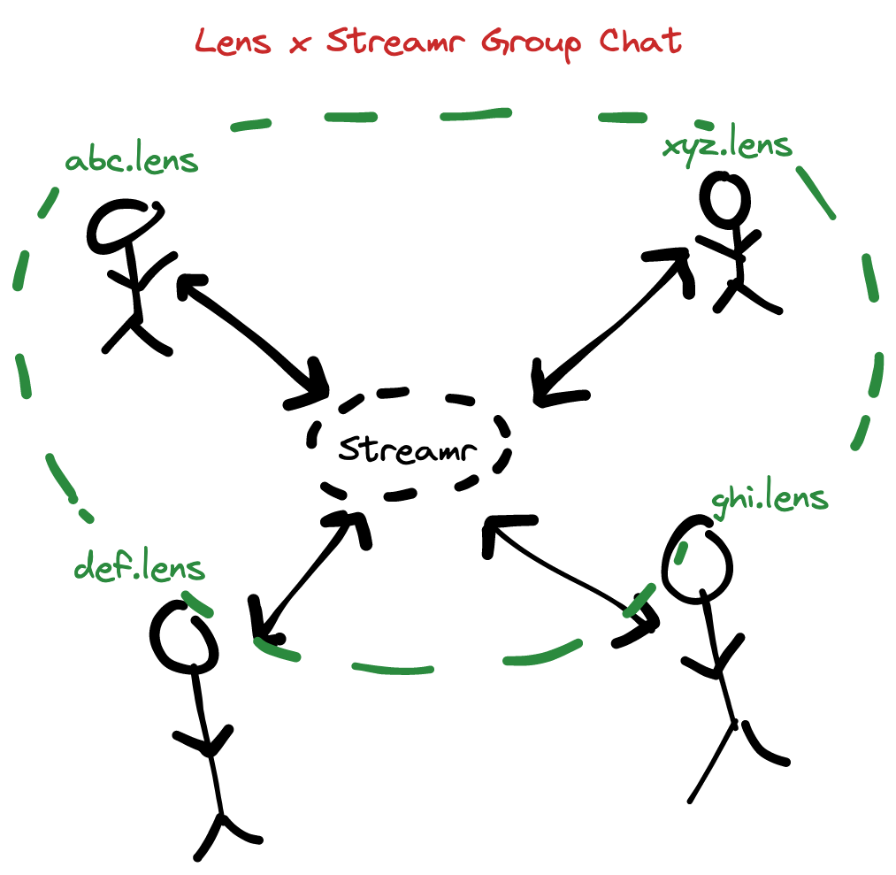

# Lens x Streamr Group Chat

**Deployed at https://streamr-lens-group-chat.vercel.app/**

This project is a humble attempt at creating a group chat app powered by Streamr that lets people chat with their Lens friends.

You can already chat with your Lens friends via direct messages on platforms like [Lenster](https://lenster.xyz), but it does not have support for group chats yet. This project tries to fill that gap.

## How it works

This is what a typical user journey looks like:

1. User visits the site and connects their Metamask wallet.
2. User is connected to the 'default' public group. They can see all the messages sent by other users in the group.
3. User can create their own 'stream' (group chat).
4. User searches for their Lens friends in the sidebar and grants them access to their group chat.
5. User shares the stream ID of their group chat with their friends.
6. User's friends can now join the group chat by visiting the site and entering the stream ID of the group chat.

## Current issues

I have already reported these issues in the `#dev` channel on the Streamr Discord server but I am listing them here as well.

- Often times, the Streamr SDK repetitively requests for message signatures when it tries to subscribe to a stream and has to _decode_ messages sent by other accounts. It eventually then throws an error saying that the decode operation has timed out. It does not happen every time, but it happens often enough to be a problem. I have tried to debug this issue but I have not been able to find the root cause yet. This is a major issue because it makes the app unusable since it cannot decode messages sent by other accounts.
- The stream creation flow is not very intuitive. After connecting your Metamask wallet, you will be taken to a default public stream. From here on at the top, you would have to manually type in a stream ID in this format: `<your_address>/stream/name` and click 'Set Stream' for things to work.
- Keyboard shortcuts don't work. For example, pressing `Enter` does not send a message. You have to click the 'Send' button.
- There are no success or error 'toast' notifications. For example, when you create a new stream, there is no indication that the stream was created successfully.

## Todos / Ideas

- [ ] Add support for multiple groups
- [ ] Add support for group chat invites via links
- [ ] Add support for media sharing via IPFS/Arweave
- [ ] Think of a notification layer
- [ ] Right now, you cannot see the list of people who have joined the group. Add support for that.
- [ ] Sign-in with Lens instead of just Metamask. This will let people interact with Lens directly from within this app.
- [ ] Let people 'kick' other people out of the group
- [ ] Private broadcast channels. For example, group chats where only people who have paid to follow a certain Lens handle can join and only the admin can send messages.

## Tech used

- Streamr Network as the communication layer
- Streamr Storage Nodes for storing the messages
- `streamr-client` for interacting with the Streamr network
- `@lens-protocol/client` for fetching data from Lens Protocol
- Next.js and React to build the user interface

## How to run locally

1. Clone the repo
2. Run `npm install`
3. Run `npm run dev`
4. Connect your Metamask wallet to the site.
